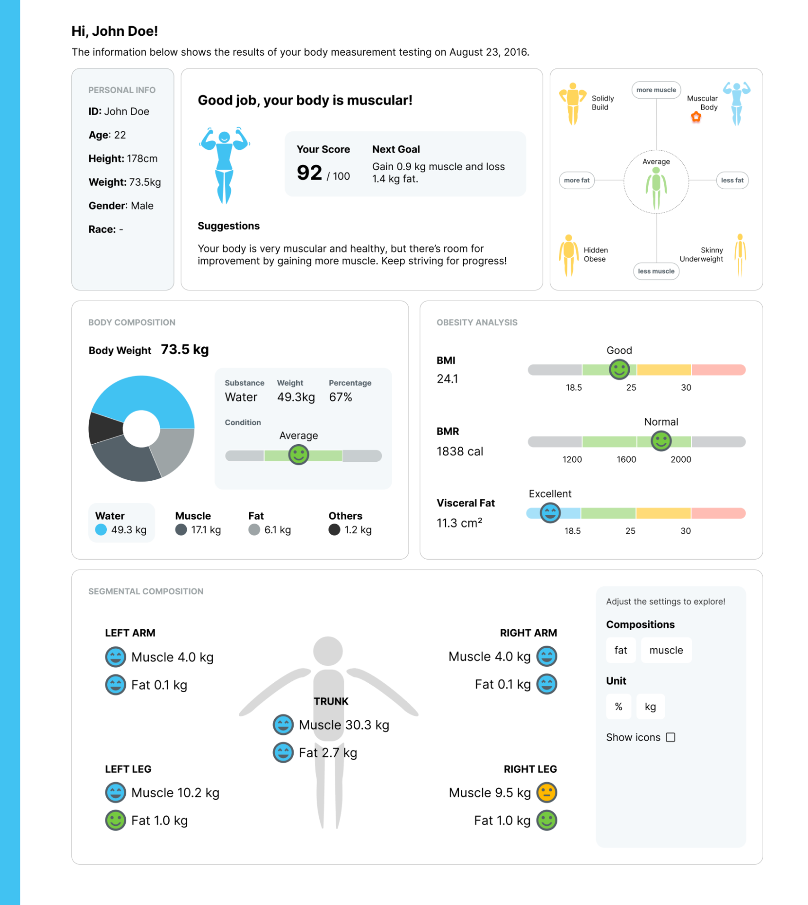
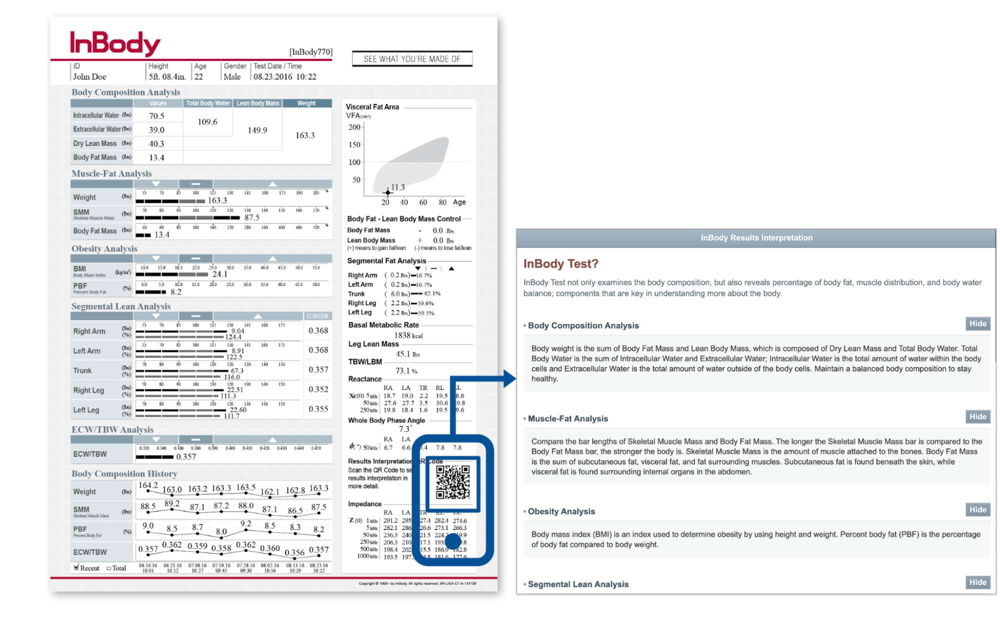
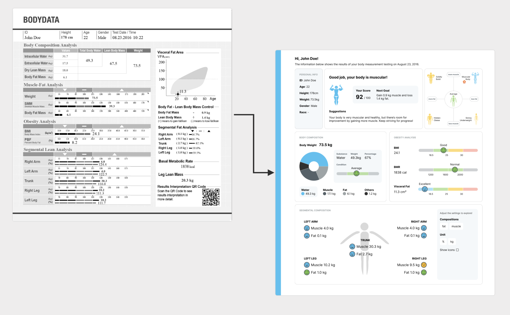
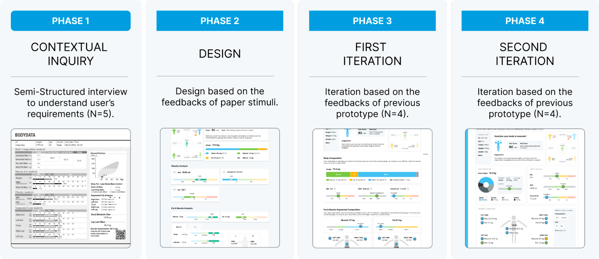

# A Smarter Way to Understand Your Body (TIU Master Thesis)

## [Demo here](https://bodydata-dashboard.netlify.app/)

## Project Overview

This project focuses on designing an interactive platform to improve the understanding of body composition data. By developing an online platform with intuitive tools and visualizations, the goal is to provide users with a user-friendly experience for interpreting their body data effectively.

### Dashboard Interaction

## Tech Stack (No libraries!)

I used React.js, JavaScript, and pure CSS to build this dashboard project. I intentionally avoided using external libraries to hone my skills in JavaScript and CSS. The components, including the bar chart and pie chart, are designed for reusability. Developers can easily customize the data by simply entering it in the corresponding format. Additionally, metrics such as weight and BMI are calculated automatically and updated in real-time as users input different data in the sidebar.

## Problem: Troublesome Paper-based Measurement Result
Traditional paper-based body measurement result sheets lack interactivity and can be challenging to interpret. Users often need to scan QR codes for additional information, leading to inconvenience. The uncertainties about evaluating the understanding of the information still remain. It remains unclear how recipients struggle to interpret the data on these sheets, including numerical statistics.

## Solution: Introducing the User-Friendly Online Platform

To address this challenge, an interactive online platform is proposed to provide a digital interface that enables users to actively explore body composition data. The platform aims to simplify the understanding of body data and provide an effective and user-friendly experience.

## Design Process

1. **Understanding User Needs with Current Paper-based Form**: Conduct qualitative usability testing to gain insights into users' interactions with the paper-based body measurement sheet. Semi-structured interviews reveal varied interpretations and challenges faced by users.

2. **Design**: Enhancements are made to improve both verbatim and gist understandings of the datasheet. Simplifications are made to enhance verbatim understanding, while visual aids and descriptions are incorporated to facilitate gist memorization.

3. **First Iteration**: Participants provide feedback to enhance the interactive prototype's usability, focusing on interface and information design. Updates include improvements in wording, adjustments to color schemes, and enhancements to interaction design.

4. **Second Iteration**: Further improvements are made based on user feedback to enhance usability. Adjustments include a more compact dashboard layout, incorporation of interactive features, and transformation of the bar chart into a pie chart.

## Getting Started

To start using the interactive platform:
1. Install the necessary dependencies: `npm install`
2. Run the development server: `npm start`

## Additional Resources

For more information on the design process and methodology, visit [here](https://wentungwen.github.io/wen_2022/body.html).

Feel free to explore the platform and leverage its features for analyzing your body composition data effectively! If you have any questions or feedback, don't hesitate to reach out.